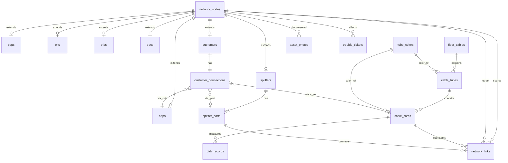

# DATABASE DESIGN — HFNMS

> **Acuan utama:** [`NETWORK_ENGINEERING_RULES.md`](NETWORK_ENGINEERING_RULES.md)  
> **Prinsip:** Network Graph (Node + Link) + Domain Extension Tables  
> **Tujuan:** 80% keberhasilan Fiber Path Tracing ditentukan oleh desain database ini.

---

## 1. Filosofi Desain

### 1.1 Hybrid Graph + Domain Model

| Lapisan | Fungsi |
|---------|--------|
| **Graph Layer** | `network_nodes` + `network_links` — tracing, GIS, impact analysis |
| **Domain Layer** | Tabel per tipe aset — validasi bisnis, penomoran, atribut teknis |
| **Cable Layer** | `fiber_cables` → `cable_tubes` → `cable_cores` — core & tube management |
| **Connection Layer** | `customer_connections`, `splitter_ports` — terminasi fisik |
| **Ops Layer** | `trouble_tickets`, `otdr_records`, `audit_logs` — operasional NOC |

**Mengapa tidak satu tabel besar?**

- Tracing butuh graph traversal cepat (node ↔ link)
- Setiap tipe aset punya atribut berbeda (splitter ratio, customer VLAN, OLT slot)
- Penomoran & status wajib sesuai engineering rules

### 1.2 Hierarki Wajib

```
POP → OLT → OTB → ODC → Splitter → ODP → Customer
```

Setiap `customer` **WAJIB** terhubung ke chain lengkap via `network_links` + `customer_connections`.

---

## 2. Diagram Relasi (ER Overview)



---

## 3. Tabel Inti — Network Graph

### 3.1 `network_nodes`

**Satu baris = satu aset di peta & graph.**

| Kolom | Tipe | Wajib | Keterangan |
|-------|------|-------|------------|
| id | BIGINT UNSIGNED PK | ✓ | |
| uuid | CHAR(36) UNIQUE | ✓ | QR Code & public URL |
| type | ENUM | ✓ | `pop`,`olt`,`otb`,`odc`,`splitter`,`odp`,`customer` |
| code | VARCHAR(50) UNIQUE | ✓ | `OTB-001`, `HNT000001`, dll. |
| name | VARCHAR(255) | ✓ | Nama tampilan |
| latitude | DECIMAL(10,8) | ✓* | *Wajib untuk pop,otb,odc,odp,customer |
| longitude | DECIMAL(11,8) | ✓* | |
| parent_id | FK → network_nodes | | Hierarki referensi cepat |
| status | ENUM | ✓ | `active`,`inactive`,`maintenance`,`fault` |
| qr_code_path | VARCHAR(255) | | File QR generated |
| address | TEXT | | Alamat fisik |
| notes | TEXT | | |
| created_at / updated_at | TIMESTAMP | ✓ | |
| deleted_at | TIMESTAMP | | Soft delete |

**Index:** `(type, status)`, `(latitude, longitude)`, `parent_id`, `code`

**Relasi Eloquent:**

```php
parent()      → BelongsTo NetworkNode
children()    → HasMany NetworkNode
outgoingLinks() → HasMany NetworkLink (source_node_id)
incomingLinks() → HasMany NetworkLink (target_node_id)
```

---

### 3.2 `network_links`

**Satu baris = satu hubungan fisik/logis antar node. Inti path tracing.**

| Kolom | Tipe | Wajib | Keterangan |
|-------|------|-------|------------|
| id | BIGINT UNSIGNED PK | ✓ | |
| source_node_id | FK → network_nodes | ✓ | Node asal |
| target_node_id | FK → network_nodes | ✓ | Node tujuan |
| link_type | ENUM | ✓ | `fiber_cable`,`patch_cord`,`splitter_connection`,`splice`,`drop` |
| direction | ENUM | | `upstream`,`downstream`,`bidirectional` |
| cable_id | FK → fiber_cables | | Jika via kabel |
| cable_core_id | FK → cable_cores | | Core spesifik |
| source_port_id | FK → splitter_ports | | Port keluar |
| target_port_id | FK → splitter_ports | | Port masuk |
| length_meters | DECIMAL(10,2) | | Panjang segmen |
| loss_db | DECIMAL(6,3) | | Redaman segmen |
| metadata | JSON | | OTDR snapshot, teknisi, dll. |
| status | ENUM | ✓ | `active`,`cut`,`spare`,`planned` |
| created_at / updated_at | TIMESTAMP | ✓ | |
| deleted_at | TIMESTAMP | | |

**Index:** `(source_node_id, target_node_id)`, `cable_core_id`, `link_type`

**Aturan tracing:** Traversal dari `customer` node naik ke `pop` mengikuti `target → source` atau `parent_id` + `links` yang konsisten.

---

## 4. Tabel Kabel — Core & Tube Management

### 4.1 `tube_colors` (Master Data)

Referensi warna EIA/TIA-598-A — sudah ada, perlu update nama ke Bahasa Indonesia.

| Kolom | Tipe | Keterangan |
|-------|------|------------|
| id | PK | |
| standard | VARCHAR(20) | `eia_tia_598a` |
| tube_number | TINYINT | 1–12 |
| color_name | VARCHAR(50) | Biru, Orange, Hijau, ... |
| hex_code | CHAR(7) | `#0000FF`, dll. |
| core_position | TINYINT | Posisi core 1–12 dalam tube |

**Seed:** 12 warna sesuai `NETWORK_ENGINEERING_RULES.md`

---

### 4.2 `fiber_cables`

| Kolom | Tipe | Wajib | Keterangan |
|-------|------|-------|------------|
| id | BIGINT PK | ✓ | |
| code | VARCHAR(50) UNIQUE | ✓ | `CBL-96-WEST-TRUNK-01` |
| name | VARCHAR(255) | ✓ | |
| cable_type | ENUM | ✓ | `backbone`,`distribution`,`drop` |
| core_count | SMALLINT | ✓ | `12`,`24`,`48`,`96` |
| tube_count | TINYINT | ✓ | Auto: 1,2,4,8 |
| manufacturer | VARCHAR(100) | | Corning, dll. |
| fiber_type | VARCHAR(50) | | G.652.D |
| jacket_rating | VARCHAR(50) | | LSZH |
| length_meters | DECIMAL(10,2) | | |
| route_geometry | JSON | | GeoJSON LineString (GIS) |
| start_node_id | FK → network_nodes | | Titik awal |
| end_node_id | FK → network_nodes | | Titik akhir |
| installed_at | DATE | | Tanggal pemasangan |
| status | ENUM | ✓ | `active`,`inactive`,`damaged`,`planned` |
| qr_code_path | VARCHAR(255) | | QR kabel |
| metadata | JSON | | |
| created_at / updated_at | TIMESTAMP | ✓ | |
| deleted_at | TIMESTAMP | | |

**Validasi bisnis:**

| core_count | tube_count |
|------------|------------|
| 12 | 1 |
| 24 | 2 |
| 48 | 4 |
| 96 | 8 |

---

### 4.3 `cable_tubes` *(BARU — belum ada di migrasi)*

Representasi fisik tube dalam kabel.

| Kolom | Tipe | Wajib | Keterangan |
|-------|------|-------|------------|
| id | BIGINT PK | ✓ | |
| cable_id | FK → fiber_cables | ✓ | |
| tube_number | TINYINT | ✓ | 1–8 |
| tube_color_id | FK → tube_colors | ✓ | Warna tube |
| core_start | TINYINT | ✓ | Core awal (1, 13, 25...) |
| core_end | TINYINT | ✓ | Core akhir (12, 24, 36...) |
| status | ENUM | ✓ | `active`,`damaged` |
| created_at / updated_at | TIMESTAMP | ✓ | |

**Unique:** `(cable_id, tube_number)`

**Auto-generate:** Saat kabel dibuat, tube & core di-generate otomatis via `CableProvisioningService`.

---

### 4.4 `cable_cores`

| Kolom | Tipe | Wajib | Keterangan |
|-------|------|-------|------------|
| id | BIGINT PK | ✓ | |
| cable_id | FK → fiber_cables | ✓ | |
| cable_tube_id | FK → cable_tubes | ✓ | |
| core_number | TINYINT | ✓ | 1–96 |
| core_position_in_tube | TINYINT | ✓ | 1–12 |
| tube_color_id | FK → tube_colors | ✓ | |
| color_name | VARCHAR(50) | | Denormalized: Biru, Orange... |
| status | ENUM | ✓ | `available`,`used`,`reserved`,`broken`,`maintenance` |
| source_node_id | FK → network_nodes | | Terminasi A |
| target_node_id | FK → network_nodes | | Terminasi Z |
| loss_db | DECIMAL(6,3) | | Redaman core |
| metadata | JSON | | |
| created_at / updated_at | TIMESTAMP | ✓ | |

**Unique:** `(cable_id, core_number)`

**Status wajib** — tidak boleh NULL (sesuai engineering rules).

---

## 5. Tabel Domain — Extension per Tipe Node

Setiap tabel punya `network_node_id` UNIQUE → FK ke `network_nodes`.

### 5.1 `pops`

| Kolom | Tipe | Keterangan |
|-------|------|------------|
| id | PK | |
| network_node_id | FK UNIQUE | |
| upstream_provider | VARCHAR(100) | |
| router_model | VARCHAR(100) | |
| monitoring_enabled | BOOLEAN | |

### 5.2 `olts`

| Kolom | Tipe | Keterangan |
|-------|------|------------|
| id | PK | |
| network_node_id | FK UNIQUE | |
| pop_id | FK → pops | |
| brand | VARCHAR(100) | |
| model | VARCHAR(100) | |
| slot_count | TINYINT | |
| pon_port_count | SMALLINT | |
| ip_address | VARCHAR(45) | |
| snmp_community | VARCHAR(100) | |

### 5.3 `otbs`

| Kolom | Tipe | Keterangan |
|-------|------|------------|
| id | PK | |
| network_node_id | FK UNIQUE | |
| code | VARCHAR(20) UNIQUE | `OTB-001` format |
| olt_id | FK → olts | |
| tray_count | TINYINT | |
| capacity_cores | SMALLINT | |

### 5.4 `odcs`

| Kolom | Tipe | Keterangan |
|-------|------|------------|
| id | PK | |
| network_node_id | FK UNIQUE | |
| code | VARCHAR(20) UNIQUE | `ODC-001` format |
| otb_id | FK → otbs | |
| port_capacity | SMALLINT | e.g. 512 |
| port_used | SMALLINT | Counter |
| split_ratio_default | VARCHAR(10) | 1:32 |

### 5.5 `odps`

| Kolom | Tipe | Keterangan |
|-------|------|------------|
| id | PK | |
| network_node_id | FK UNIQUE | |
| code | VARCHAR(20) UNIQUE | `ODP-001` format |
| odc_id | FK → odcs | |
| port_capacity | SMALLINT | |
| port_used | SMALLINT | |

### 5.6 `splitters`

| Kolom | Tipe | Keterangan |
|-------|------|------------|
| id | PK | |
| network_node_id | FK UNIQUE | |
| odc_id | FK → odcs | |
| ratio | ENUM | `1:2`,`1:4`,`1:8`,`1:16`,`1:32`,`1:64` |
| input_port_count | TINYINT | Biasanya 1 |
| output_port_count | TINYINT | Sesuai ratio |
| brand | VARCHAR(100) | |

### 5.7 `splitter_ports` *(sudah ada — perlu update status)*

| Kolom | Tipe | Keterangan |
|-------|------|------------|
| id | PK | |
| splitter_id | FK → splitters | *ubah dari splitter_node_id* |
| port_number | TINYINT | |
| direction | ENUM | `input`,`output` |
| label | VARCHAR(30) | `IN-1`, `OUT-3` |
| status | ENUM | `empty`,`active`,`reserved`,`broken`,`maintenance` |
| connected_core_id | FK → cable_cores | |
| metadata | JSON | |

**Unique:** `(splitter_id, port_number, direction)`

---

### 5.8 `customers`

| Kolom | Tipe | Keterangan |
|-------|------|------------|
| id | PK | |
| network_node_id | FK UNIQUE | |
| code | VARCHAR(20) UNIQUE | `HNT000001` format |
| name | VARCHAR(255) | |
| phone | VARCHAR(20) | |
| email | VARCHAR(255) | |
| address | TEXT | |
| service_type | ENUM | `home`,`business` |
| vlan_tag | SMALLINT | |
| ip_address | VARCHAR(45) | |
| onu_serial | VARCHAR(100) | |
| rx_power_dbm | DECIMAL(5,2) | Real-time metric |
| tx_power_dbm | DECIMAL(5,2) | |
| status | ENUM | `active`,`suspended`,`terminated` |
| registered_at | DATE | |

---

### 5.9 `customer_connections` *(BARU — kunci tracing)*

Menyimpan terminasi fisik pelanggan — **jembatan antara customer dan graph**.

| Kolom | Tipe | Keterangan |
|-------|------|------------|
| id | PK | |
| customer_id | FK → customers | UNIQUE |
| odp_id | FK → odps | ✓ |
| odp_port_number | TINYINT | Port di ODP |
| splitter_port_id | FK → splitter_ports | Port output splitter |
| cable_core_id | FK → cable_cores | Core drop ke pelanggan |
| drop_cable_length_m | DECIMAL(8,2) | |
| splice_loss_db | DECIMAL(5,3) | |
| path_trace_id | VARCHAR(30) | `TRC-FX-9921-A` |
| is_path_complete | BOOLEAN | ✓ Wajib TRUE sebelum aktif |
| verified_at | TIMESTAMP | |
| verified_by | FK → users | |
| created_at / updated_at | TIMESTAMP | |

**Validasi:** `is_path_complete = true` hanya jika chain Customer→ODP→Splitter→ODC→OTB→OLT→POP ter-resolve.

---

## 6. Tabel Operasional

### 6.1 `asset_photos`

| Kolom | Tipe | Keterangan |
|-------|------|------------|
| id | PK | |
| network_node_id | FK | Nullable |
| cable_id | FK | Nullable |
| photo_type | ENUM | `location`,`device`,`splice`,`other` |
| file_path | VARCHAR(255) | |
| caption | VARCHAR(255) | |
| uploaded_by | FK → users | |
| created_at | TIMESTAMP | |

**Minimal:** 1 foto lokasi + 1 foto perangkat per aset.

---

### 6.2 `trouble_tickets`

| Kolom | Tipe | Keterangan |
|-------|------|------------|
| id | PK | |
| ticket_number | VARCHAR(30) UNIQUE | `INC-2023-8942` |
| title | VARCHAR(255) | |
| description | TEXT | |
| status | ENUM | `open`,`assigned`,`on_progress`,`pending`,`resolved`,`closed` |
| priority | ENUM | `low`,`medium`,`high`,`critical` |
| category | VARCHAR(100) | Kabel putus, latensi tinggi, dll. |
| affected_node_id | FK → network_nodes | |
| affected_core_id | FK → cable_cores | |
| assigned_to | FK → users | |
| reported_by | FK → users | |
| resolved_at | TIMESTAMP | |
| created_at / updated_at | TIMESTAMP | |

---

### 6.3 `otdr_records`

| Kolom | Tipe | Keterangan |
|-------|------|------------|
| id | PK | |
| cable_core_id | FK → cable_cores | |
| measured_at | DATETIME | |
| technician_id | FK → users | |
| fault_distance_m | DECIMAL(10,2) | Jarak gangguan |
| loss_db | DECIMAL(6,3) | |
| total_attenuation_db | DECIMAL(6,3) | |
| reflectance_db | DECIMAL(6,3) | |
| orl_db | DECIMAL(6,3) | |
| health_score | TINYINT | 0–100 |
| notes | TEXT | |
| file_path | VARCHAR(255) | File hasil OTDR |
| created_at | TIMESTAMP | |

---

### 6.4 `audit_logs`

| Kolom | Tipe | Keterangan |
|-------|------|------------|
| id | PK | |
| user_id | FK → users | |
| action | VARCHAR(100) | create, update, delete |
| auditable_type | VARCHAR(100) | Morph class |
| auditable_id | BIGINT | Morph id |
| old_values | JSON | |
| new_values | JSON | |
| ip_address | VARCHAR(45) | |
| user_agent | VARCHAR(255) | |
| created_at | TIMESTAMP | |

---

## 7. Algoritma Fiber Path Tracing

### 7.1 Input / Output

```
Input:  customer_id atau customer.code (HNT000001)
Output: PathTraceResult {
    trace_id,
    customer,
    hops: [ { type, code, name, gps, port?, core?, loss_db } ],
    metrics: { rx_power, distance_km, latency_ms },
    is_complete: boolean
}
```

### 7.2 Langkah Traversal

```
1. Load customer → network_node (type=customer)
2. Load customer_connections → odp, splitter_port, cable_core
3. Dari ODP node, traverse network_links / parent_id ke Splitter
4. Dari Splitter, resolve input port → output port chain
5. Naik ke ODC → OTB → OLT → POP via network_links
6. Setiap hop kumpulkan: GPS, core, port, loss_db
7. Validasi: semua 7 level hierarchy ada → is_complete = true
8. Jika ada gap → is_complete = false, log missing segment
```

### 7.3 Service Layer

```
App\Services\Network\PathTracingService
  → traceByCustomerId(int $id): PathTraceResult
  → traceByCustomerCode(string $code): PathTraceResult
  → validatePathCompleteness(int $customerId): bool

App\Services\Network\ImpactAnalysisService
  → affectedCustomersByCore(int $coreId): Collection
  → affectedCustomersByNode(int $nodeId): Collection
```

---

## 8. Mapping UI Stitch → Modul → Tabel

| Screen Stitch | Modul | Tabel Utama |
|---------------|-------|-------------|
| Dasbor Eksekutif | dashboard | Aggregasi dari `cable_cores`, `trouble_tickets`, `network_nodes` |
| Alat Penelusuran Jalur | path-tracing | `customers`, `customer_connections`, `network_links`, `splitter_ports` |
| Manajemen Kabel | cable-management | `fiber_cables`, `cable_tubes`, `cable_cores` |
| Peta Jaringan GIS | gis-map | `network_nodes`, `fiber_cables.route_geometry` |
| Login | auth | `users`, Spatie roles |

---

## 9. Gap Analysis — Migrasi Saat Ini vs Target

| Item | Status Saat Ini | Target | Aksi |
|------|-----------------|--------|------|
| `network_nodes` | ✅ Ada | Sesuai | Tambah validasi GPS per type |
| `network_links` | ✅ Ada | Sesuai | Tambah `direction`, `loss_db` |
| `fiber_cables` | ✅ Ada | Perlu 96 core | Update enum + validasi tube_count |
| `cable_cores` | ✅ Ada | Status salah | Migrate status ke engineering rules |
| `cable_tubes` | ❌ Belum ada | Wajib | **Migrasi baru** |
| `tube_colors` | ✅ Ada | Nama English | Update seeder ke Bahasa Indonesia |
| `splitter_ports` | ✅ Ada | FK salah | Refactor FK ke `splitters` table |
| Domain tables (pops, olts...) | ❌ Belum ada | Wajib | **Migrasi baru** |
| `customer_connections` | ❌ Belum ada | Wajib | **Migrasi baru** |
| `asset_photos` | ❌ Belum ada | Wajib | **Migrasi baru** |
| `trouble_tickets` | ❌ Belum ada | Wajib | **Migrasi baru** |
| `otdr_records` | ❌ Belum ada | Wajib | **Migrasi baru** |
| `audit_logs` | ❌ Belum ada | Wajib | **Migrasi baru** |
| CMS tables | ✅ Ada | OK | Tidak berubah |

---

## 10. Urutan Migrasi (Rekomendasi)

```
Fase 1 — Domain Extension
  1. pops, olts, otbs, odcs, odps, splitters, customers
  2. Refactor splitter_ports.splitter_id

Fase 2 — Cable Enhancement
  3. cable_tubes
  4. Alter cable_cores (status enum, cable_tube_id)
  5. Alter fiber_cables (96 core, manufacturer fields)

Fase 3 — Tracing Foundation
  6. customer_connections
  7. Alter network_links (direction, loss_db)

Fase 4 — Operations
  8. asset_photos
  9. trouble_tickets
  10. otdr_records
  11. audit_logs

Fase 5 — Data & Services
  12. Seed tube_colors (Bahasa Indonesia)
  13. CableProvisioningService (auto tube+core)
  14. PathTracingService
  15. ImpactAnalysisService
```

---

## 11. Konvensi Penamaan

| Entity | Format | Contoh |
|--------|--------|--------|
| OTB | `OTB-NNN` | OTB-001 |
| ODC | `ODC-NNN` | ODC-042 |
| ODP | `ODP-NNN` | ODP-001 |
| Customer | `HNTNNNNNN` | HNT000001 |
| Cable | `CBL-{cores}-{zone}-{name}` | CBL-96-WEST-TRUNK-01 |
| Trace | `TRC-FX-{id}` | TRC-FX-9921-A |
| Ticket | `INC-{year}-{seq}` | INC-2023-8942 |

---

## 12. Aturan Integritas Data

1. **Tidak boleh** customer aktif tanpa `customer_connections.is_path_complete = true`
2. **Tidak boleh** core `used` tanpa `source_node_id` dan `target_node_id`
3. **Tidak boleh** splitter tanpa port input + port output sesuai ratio
4. **Tidak boleh** kabel tanpa `cable_tubes` dan `cable_cores` yang lengkap
5. **Tidak boleh** hapus node yang masih direferensi link aktif
6. Semua perubahan status core/port → tulis `audit_logs`

---

## 13. Referensi

- [`NETWORK_ENGINEERING_RULES.md`](NETWORK_ENGINEERING_RULES.md) — Standar engineering
- [`PROJECT_OVERVIEW.md`](PROJECT_OVERVIEW.md) — Ruang lingkup sistem
- [`ARCHITECTURE.md`](ARCHITECTURE.md) — Arsitektur aplikasi
- [`migrations/README.md`](migrations/README.md) — Index migrasi

**Langkah berikutnya:** Implementasi Fase 1 migrasi setelah persetujuan desain ini.
